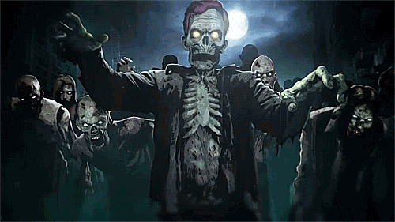

<h1 align="center">
    Zombie Survival Game 🧟
</h1>

    
    
        
        
     
    
     
     
     
        

    

# Description 🎮
- This is a zombie survival game where you must make the best choices and decisions possible in order to live. As a
  survivor, you will encounter zombies, weapons, people, and a merchant to buy from with an in-game currency. Every
  decision you make has a cause and effect while some lead you to fortune and others lead you to death.
  
  

# [Requirements](https://github.com/JordanLeich/Zombie-Survival-Game/blob/main/requirements.txt) ⚡

# TODO List ❗
- Check out the issues page for this game project [here](https://github.com/JordanLeich/Zombie-Survival-Game/issues/1).
